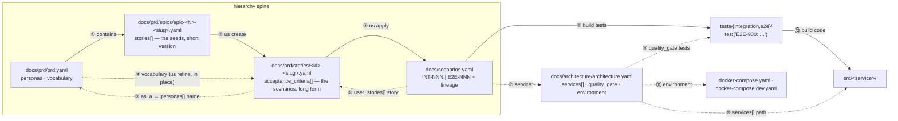

# The document universe

> Interactive companion: [`doc-universe.html`](./doc-universe.html) — same content with a hoverable join map; open it in a browser.

A host project hands TrueBDD five YAML documents under `docs/` plus an engine configuration
directory. Five CLI commands walk them in order — each one reads some documents, validates
against a checklist, and writes exactly one thing. Every arrow below is a real cross-reference
you can grep for.

## The hierarchy

The documents form a strict containment chain, each level owning only its own detail:

```text
prd  ⟷  epics  ⟷  user stories  ⟷  scenarios
```

- **PRD** (`docs/prd/prd.yaml`) sits at the top; **epics** (`docs/prd/epics/*.yaml`) are its
  children — each decomposes the product goal into story seeds.
- An **epic contains only the short version** of each user story: id, title,
  `as_a` / `i_want` / `so_that`, bare acceptance-criteria stubs. No steps.
- The **long version of a story lives in its own file** under `docs/prd/stories/`, created from
  the epic seed by `us create <id>` and grown in place by `us refine <id>`.
- A **story consists of scenarios** — its refined ACs with given/when/then steps *are* the
  scenarios, long form, living inside the story file.
- **Then the gap**: scenarios fall into the central registry `docs/scenarios.yaml` only when
  `us apply <id>` runs. Until then the registry lags the stories. `us apply` is the registry's
  only writer, and the registry — not the story — is what the `build` pipeline reads.

Each link in the chain is materialized by a command: epic → story file by `us create`,
story scenarios → registry by `us apply`.

## What the host project contains

The engine ships `true-bdd/` and `templates/`; the host authors everything under `docs/`,
`src/`, and `tests/`.

```text
host project root
├── true-bdd/
│   ├── true-bdd.yaml            engine config — paths to everything else
│   └── checklists/*.yaml        one per command, resolved by name
├── templates/*.prompt.tpl       prompt templates (shipped by the engine repo)
├── docs/
│   ├── prd/
│   │   ├── prd.yaml             product ref + personas + BDD vocabulary
│   │   ├── epics/epic-<N>-<slug>.yaml
│   │   └── stories/<id>-<slug>.yaml
│   ├── architecture/architecture.yaml   services + dev/prod environments
│   └── scenarios.yaml           the central scenario registry
├── src/<service>/               production source — src/service1, src/service2, …
├── docker-compose.yaml          prod stack — path declared in architecture.yaml
├── docker-compose.dev.yaml      dev stack for local runs
└── tests/{integration,e2e}/     executable specs
```

| Category | Documents |
| --- | --- |
| **Product docs** | prd (incl. the BDD vocabulary) — epic — story |
| **Scenario registry** | the merge target — single source of truth for behavior |
| **Architecture** | services, test layers, dev/prod environment stacks |
| **Code artifacts** | specs, production source, compose stacks |
| **Engine config** | wiring, not data flow |

## How the documents join

The top row is the hierarchy spine — the prd contains epics, an epic seed becomes a story file
(`us create`), and the story's refined ACs — its scenarios — merge into the registry
(`us apply`). Dotted arrows are reference joins. Numbers index into the joins table below.



Engine config (`true-bdd/true-bdd.yaml`, `checklists/`, `templates/`) wires the walk itself:
joins 13–16 in the table below.

## Who reads what, who writes what

The pipeline runs left to right through the map: each command consumes the previous command's
output. Every command validates its subject against its own checklist, and with `--fix` drives a
Claude-mediated loop until the walk is clean.

| Command | Reads | Checklist | Writes |
| --- | --- | --- | --- |
| `us create <id>` | the story seed in its **epic**; **prd** + **architecture** as prompt context | us-create.yaml | a new **story file** in `paths.stories_dir` |
| `us refine <id>` | the **story**; **prd** personas + vocabulary; **architecture** test layers (for sketches) | us-refine.yaml | the same **story file, in place** — ACs gain steps and rule-based descriptions |
| `us apply <id>` | every **AC** of the refined story (lineage id `<id>-NNN` per AC position) | us-apply.yaml | merges into **scenarios.yaml** via a scratch copy; re-walks to a fixpoint (≤ `max_apply_attempts`), then commits it over the registry |
| `build tests` | every **registry scenario**; greps test trees for the id | build-tests.yaml | with `--fix`: missing **specs** under `tests/` referencing the scenario id — the registry is never modified |
| `build code` | every **(service, layer)** pair in architecture; discovers failing tests via each framework's runner (dev compose stack backs the run) | build-code.yaml | with `--fix`: **production source** under `src/` only — tests and registry are never touched |

## Every cross-reference, with real values

Example values come from the BDD fixtures. Numbers match the arrows on the map.

| # | From | To | How it joins |
| --- | --- | --- | --- |
| 1 | prd.yaml | epics/*.yaml | epics are the prd's children — each decomposes the product goal into story seeds; the containment is by location: `docs/prd/epics/`, declared by `epics.path` |
| 2 | epic stories[].id | story file | **us create** expands the short version in the epic into the long version: id `"99.1"` becomes `docs/prd/stories/99.1-<slug>.yaml` |
| 3 | story as_a | prd personas[].name | the us-create "who" prompt matches `as_a: "Claude User"` against the persona list |
| 4 | prd vocabulary | AC description + steps | **us refine** rewrites the story file in place, rejecting forbidden qualifiers ("quickly") and verbs ("handle" → "displays / returns / rejects"); vocabulary may also live in architecture.yaml |
| 5 | AC position in story | user_stories[].scenario_id | **us apply** bridges the gap between story and registry — it derives the lineage id `<story-id>-%03d` (AC-1 of story 95.1 → `"95.1-001"`) and merges the scenario in |
| 6 | user_stories[].story | story file path | each registry entry names its source stories: `docs/prd/stories/95.1-duplicate-collapse.yaml` |
| 7 | scenario service: | architecture services[].name | `service: "mcp-service"` must name a declared service |
| 8 | scenario id | a spec file | **build tests** passes only if some test references the id literally: `test('E2E-900: …')` |
| 9 | id prefix INT- / E2E- | quality_gate.tests layer | INT → `tests.integration` (e.g. jest), E2E → `tests.e2e` (playwright) — picks the tree, framework, and runner |
| 10 | services[].path | src/&lt;name&gt;/ | `path: src/service1` tells **build code** where production source lives |
| 11 | environment.{dev,prod} | docker-compose files | architecture.yaml declares the stack per environment: `dev → docker-compose.dev.yaml`, `prod → docker-compose.yaml` |
| 12 | failing test | production source | **build code --fix** edits `src/` until the runner's `LastRunPassed` flips to true |
| 13 | checklist prompt docs: | true-bdd.yaml documents: | `docs: [prd, architecture_yaml]` are keys — resolved to file paths, contents embedded in the prompt |
| 14 | command name | checklist file | `paths.checklists_dir` + hyphenation: `us apply` → `checklists/us-apply.yaml` |
| 15 | true-bdd.yaml documents:/paths: | prd · architecture · epics · stories dirs | all document locations are declared here; nothing else hardcodes a path |
| 16 | templates.prompts.* | templates/*.prompt.tpl | each engine role (checklist / fix_generator / fix_applier, + `_system`) maps to one template file |

---

*Drawn from the engine seed (`true-bdd/`, `templates/`) and `tests/bdd-cli` fixture documents — 2026-07-28.*
