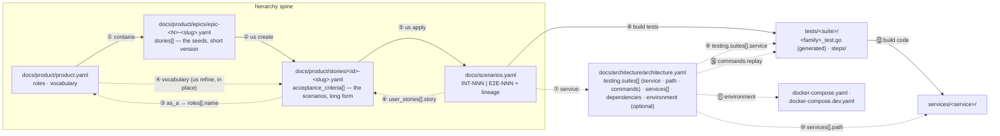

# The document universe

> Interactive companion: [`doc-universe.html`](./doc-universe.html) — same content with a hoverable join map; open it in a browser.

A host project hands TrueBDD five YAML documents under `docs/` plus an engine configuration
directory. Six CLI commands walk them in order — each one reads some documents, validates
against a checklist, and writes exactly one thing, except `scen check`, which writes nothing. Every arrow below is a real cross-reference
you can grep for.

## The hierarchy

The documents form a strict containment chain, each level owning only its own detail:

```text
product  ⟷  epics  ⟷  user stories  ⟷  scenarios
```

- **product document** (`docs/product/product.yaml`) sits at the top; **epics** (`docs/product/epics/*.yaml`) are its
  children — each decomposes the product goal into story seeds.
- An **epic contains only the short version** of each user story: id, title,
  `as_a` / `i_want` / `so_that`, bare acceptance-criteria stubs. No steps.
- The **long version of a story lives in its own file** under `docs/product/stories/`, created from
  the epic seed by `us create <id>` and grown in place by `us refine <id>`.
- A **story consists of scenarios** — its refined ACs with given/when/then steps *are* the
  scenarios, long form, living inside the story file.
- **Then the gap**: scenarios fall into the central registry `docs/scenarios.yaml` only when
  `us apply <id>` runs. Until then the registry lags the stories. `us apply` is the registry's
  only writer, and the registry — not the story — is what the `build` pipeline reads.

Each link in the chain is materialized by a command: epic → story file by `us create`,
story scenarios → registry by `us apply`.

## What the host project contains

The engine ships `true-bdd/` and `templates/`; the host authors everything under `docs/`,
the service source directories, and `tests/`.

```text
host project root
├── true-bdd/
│   ├── true-bdd.yaml            engine config — paths to everything else
│   ├── <key>-schema.yaml        yamale shape for documents.<key> — host lint, not engine
│   └── checklists/*.yaml        one per command, resolved by name
├── templates/*.prompt.tpl       prompt templates (shipped by the engine repo)
├── docs/
│   ├── product/
│   │   ├── product.yaml         product ref + roles + BDD vocabulary + glossary
│   │   ├── epics/epic-<N>-<slug>.yaml
│   │   └── stories/<id>-<slug>.yaml
│   ├── architecture/architecture.yaml   testing.suites[] + services + optional environments
│   └── scenarios.yaml           the central scenario registry (each entry names the test file it
│                                renders into, and may name its own run `timeout:`)
├── services/<service>/          production source — path declared per service in architecture.yaml
├── docker-compose.yaml          optional prod stack — path declared in architecture.yaml
├── docker-compose.dev.yaml      optional dev stack for local runs
└── tests/<suite>/
    ├── <family>_test.go         GENERATED — one func Test<Id> per scenario, from its path:
    └── steps/                   the code a scenario's steps bind to
```

| Category | Documents |
| --- | --- |
| **Product docs** | product (incl. the BDD vocabulary) — epic — story |
| **Scenario registry** | the merge target — single source of truth for behavior |
| **Architecture** | one `testing:` section (the suites and how each runs) plus services (incl. `type` and runtime `dependencies`), optional dev/prod environment stacks |
| **Code artifacts** | specs, production source, compose stacks |
| **Engine config** | wiring and document schemas, not data flow |

Each service also declares what it is (`type:` — e.g. `"cli"`, `"web:frontend"`) and what it
talks to at runtime (`dependencies[]: name · protocol · scope`). `protocol` is the connection
mechanism — cli / http / redis / …. `scope` places the dependency: `internal` (another service
declared in this file), `self_hosted` (we run the instance — redis, postgres, kafka), or
`third_party` (a vendor's service behind it, wherever the binary lives — crush is installed
locally but GLM's API is not). The scope drives dependency mocking during builds:
`third_party` gets record/replay doubles, everything else runs live.

## How the documents join

The top row is the hierarchy spine — the product document contains epics, an epic seed becomes a story file
(`us create`), and the story's refined ACs — its scenarios — merge into the registry
(`us apply`). Dotted arrows are reference joins. Numbers index into the joins table below.



Engine config (`true-bdd/true-bdd.yaml`, `checklists/`, `templates/`) wires the walk itself:
joins 13–16 in the table below. Join 17 is the one contract the engine does not read —
the schemas that pin each document's shape for the host's own lint step. Join 18 is how a
test suite says what running it actually means.

## Who reads what, who writes what

The pipeline runs left to right through the map: each command consumes the previous command's
output. Every command validates its subject against its own checklist, and with `--fix` drives a
Claude-mediated loop until the walk is clean — except `scen check`, which refuses `--fix` at
startup because no prompt in its checklist carries a fix template.

| Command | Reads | Checklist | Writes |
| --- | --- | --- | --- |
| `us create <id>` | the story seed in its **epic**; **product** as prompt context | us-create.yaml | a new **story file** in `paths.stories_dir` |
| `us refine <id>` | the **story**; **product** roles + vocabulary; **architecture** test suites (for sketches) | us-refine.yaml | the same **story file, in place** — ACs gain steps and rule-based descriptions |
| `us apply <id>` | every **AC** of the refined story (lineage id `<id>-NNN` per AC position) | us-apply.yaml | merges into **scenarios.yaml** via a scratch copy; re-walks to a fixpoint (≤ `max_apply_attempts`), then commits it over the registry |
| `build tests` | every **registry scenario**; the suite that owns it, and the step definitions under that suite's `path:` | build-tests.yaml | with `--fix` only: the **generated test file** each scenario's `path:` names, rendered deterministically, and the missing **step definition** in that suite. Without `--fix` nothing is written — the same renderer verifies the tree by regenerating and comparing. The registry is never modified either way |
| `build code` | every **suite** under `architecture.testing.suites[]`; discovers failing tests by running the suite's own declared `commands.replay` (the dev compose stack, when declared, backs the run) | build-code.yaml | with `--fix`: **production source** under the declared service paths only — tests and registry are never touched |
| `scen check [id...]` | one **registry scenario** at a time — its own description, `service:`, `path:`, lineage and steps, and never the registry file itself | scen-check.yaml | **nothing**. Advisory: findings are reported and the CLI exits 0, so it cannot gate a commit |

## Every cross-reference, with real values

Example values come from the BDD fixtures. Numbers match the arrows on the map.

| # | From | To | How it joins |
| --- | --- | --- | --- |
| 1 | product.yaml | epics/*.yaml | epics are the product document's children — each decomposes the product goal into story seeds; the containment is by location: the epics dir declared by `paths.epics_dir` (canonically `docs/product/epics/`) |
| 2 | epic stories[].id | story file | **us create** expands the short version in the epic into the long version: id `"99.1"` becomes `docs/product/stories/99.1-<slug>.yaml` |
| 3 | story as_a | product roles[].name | the us-create "who" prompt matches `as_a: "Claude User"` against the role list — roles (responsibilities), not personas (invented individuals) |
| 4 | product vocabulary | AC description + steps | **us refine** rewrites the story file in place, rejecting forbidden qualifiers ("quickly") and verbs ("handle" → "displays / returns / rejects"); vocabulary may also live in architecture.yaml |
| 5 | AC position in story | user_stories[].scenario_id | **us apply** bridges the gap between story and registry — it derives the lineage id `<story-id>-%03d` (AC-1 of story 95.1 → `"95.1-001"`) and merges the scenario in |
| 6 | user_stories[].story | story file path | each registry entry names its source stories: `docs/product/stories/95.1-duplicate-collapse.yaml` |
| 7 | scenario service: | architecture services[].name | `service: "mcp-service"` must name a declared service |
| 8 | scenario steps | step definitions | **build tests** passes only if every Given/When/Then step binds to exactly one ``suite.Step(`regexp`, …)`` in the owning suite's `steps/` package. It asks the suite that question through `commands.coverage` and walks only the scenarios with gaps, so a converged repository spends no model at all. Separately, the scenario's `path:` names the generated `func Test<Id>` that runs it — with the steps stated literally, and cross-checked against the registry before any of them run. That file is deterministic codegen rather than a model turn: `--fix` writes it, and without `--fix` the same renderer verifies the tree by regenerating and comparing |
| 9 | scenario service: | testing.suites[].service | the one join that says which suite owns a scenario, and therefore where its step definitions live. Replaced the id-prefix convention (INT- / E2E-), which lived in prompt prose and in no code |
| 10 | services[].path | services/&lt;name&gt;/ | `path: services/bdd-cli` tells **build code** where production source lives — any path works; the fixtures use `src/service1` |
| 11 | environment.{dev,prod} | docker-compose files | optional — architecture.yaml declares the stack per environment (`dev → docker-compose.dev.yaml`, `prod → docker-compose.yaml`); a host without a compose-backed environment omits the key |
| 12 | failing test | production source | **build code --fix** edits the service's source (its `services[].path`) until the runner's `LastRunPassed` flips to true |
| 13 | checklist prompt docs: | true-bdd.yaml documents: | `docs: [product, architecture_yaml]` are keys — resolved to file paths, contents embedded in the prompt |
| 14 | command name | checklist file | `paths.checklists_dir` + hyphenation: `us apply` → `checklists/us-apply.yaml` |
| 15 | true-bdd.yaml documents:/paths: | product · architecture · scenario registry · epics · stories dirs | all document locations are declared here; nothing else hardcodes a path |
| 16 | templates.prompts.* | templates/*.prompt.tpl | each engine role (checklist / fix_generator / fix_applier, + `_system`) maps to one template file |
| 17 | true-bdd/&lt;key&gt;-schema.yaml | the document at documents.&lt;key&gt; | `product-schema.yaml` pins the shape of `documents.product`. The engine never parses these — the document reaches the checklists as prompt text — so the schema is enforced by the host's lint step (`./scripts/lint-schemas.sh`, a CI gate), not by a command |
| 18 | testing.suites[].commands | the suite that actually runs | all three of `record` / `replay` / `live` are mandatory and complete, machine-readable flag included (`-json` / `--json` / `--reporter=json`); **build code** runs `replay`. The engine keeps no built-in invocation, so an incomplete block is a startup refusal, never a substituted default. A fourth key, `coverage`, is the one optional one: **build tests** runs it to learn which steps bind (writing JSON to `$TRUEBDD_COVERAGE_REPORT`), and a suite declaring none falls back to a model reading the source in prose |

---

*Drawn from the engine seed (`true-bdd/`, `templates/`) and the `tests/bdd-cli` fixture documents — 2026-08-26.*
